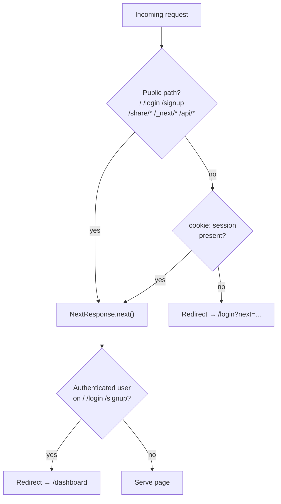
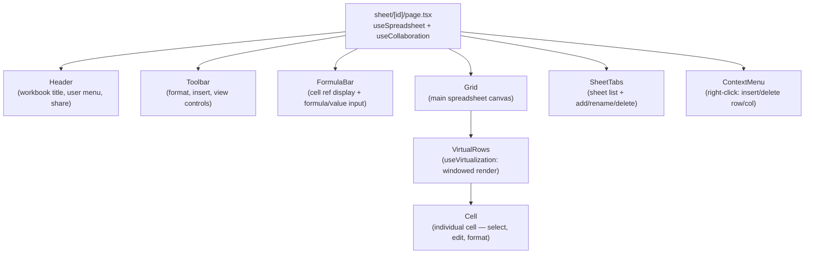
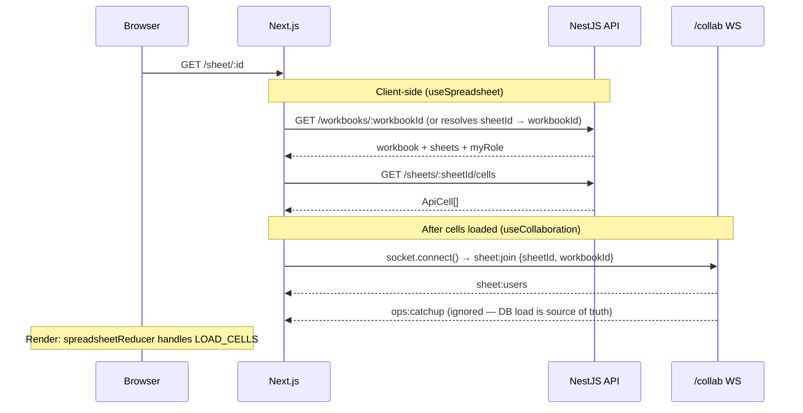

# Architecture

## App Router Structure

```
app/
├── layout.tsx              ← Root layout (fonts, globals.css, AuthContext)
├── page.tsx                ← Landing page (public)
├── globals.css
│
├── (auth)/                 ← Auth layout group (no sidebar)
│   ├── layout.tsx          ← Minimal centred layout
│   ├── login/page.tsx
│   └── signup/page.tsx
│
├── dashboard/
│   ├── layout.tsx          ← Dashboard shell (nav bar)
│   └── page.tsx            ← Workbook list, create/delete
│
├── sheet/[id]/
│   ├── page.tsx            ← Main spreadsheet editor (id = sheetId or workbookId)
│   └── loading.tsx         ← Skeleton / suspense fallback
│
├── share/[id]/
│   └── page.tsx            ← Public read-only view (id = shareToken)
│
└── settings/
    ├── layout.tsx
    ├── page.tsx            ← Profile settings
    └── security/page.tsx   ← Password change, delete account
```

---

## Route Rendering Strategy

| Route | Strategy | Why |
|---|---|---|
| `/` | Static (SSG) | Landing page — no user data |
| `/login`, `/signup` | Static | No user data, fast load |
| `/dashboard` | Dynamic (client fetch) | Needs auth cookie forwarded to API |
| `/sheet/[id]` | Dynamic (client fetch) | Live collaboration — can't SSR Socket.IO |
| `/share/[id]` | Dynamic (client fetch) | Public cells loaded from share token |
| `/settings/*` | Dynamic (client fetch) | Needs current user from DB |

---

## Middleware — Route Guarding



**Why a `session` marker cookie?** The real `accessToken` is an httpOnly cookie scoped to the API domain — Next.js middleware cannot read it. After a successful login or register, the frontend sets a short `session` cookie on the frontend domain (visible to middleware) solely to signal auth state. The actual API auth still uses the `accessToken` httpOnly cookie automatically sent with every `credentials: "include"` fetch.

---

## Component Tree (Sheet Editor)



---

## Data Flow — Initial Load



---

## Key Files

| File | Role |
|---|---|
| `middleware.ts` | Route guard — checks `session` cookie |
| `lib/auth/AuthContext.tsx` | React context for current user (fetches `/users/me`) |
| `hooks/useSpreadsheet.ts` | Workbook/sheet loading, `spreadsheetReducer` dispatch |
| `hooks/useCollaboration.ts` | CRDT + Socket.IO wiring, undo/redo |
| `store/spreadsheetStore.ts` | `spreadsheetReducer` + `SpreadsheetAction` union |
| `store/collaborationStore.ts` | `collabReducer` — users, cursors, connection state |
| `hooks/useVirtualization.ts` | Windowed row rendering for large grids |
| `hooks/useSelection.ts` | Active cell, range selection, keyboard navigation |
| `hooks/useKeyboard.ts` | Global keyboard shortcuts (Ctrl+Z/Y, Ctrl+C/V, etc.) |
