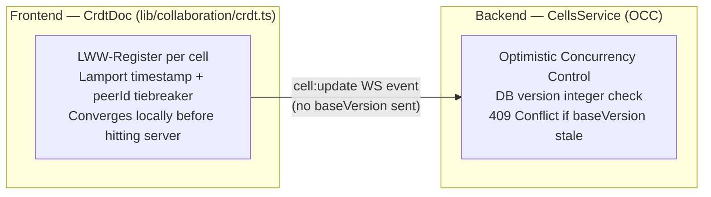
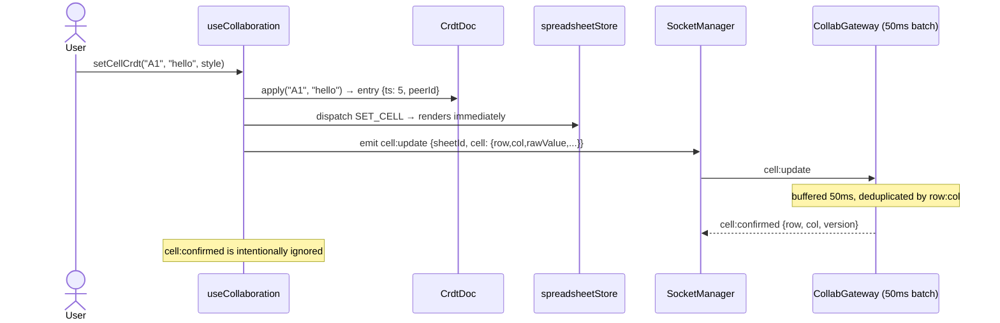
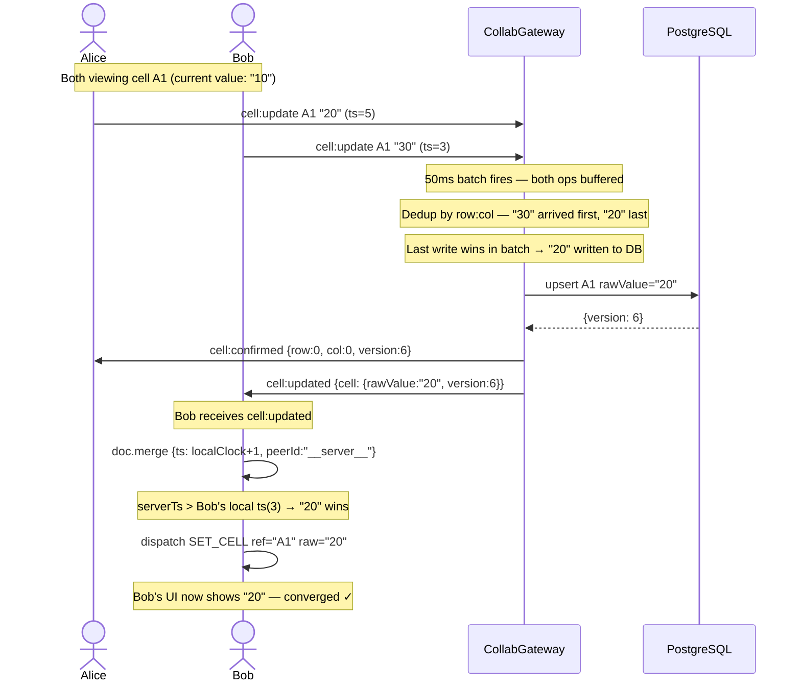
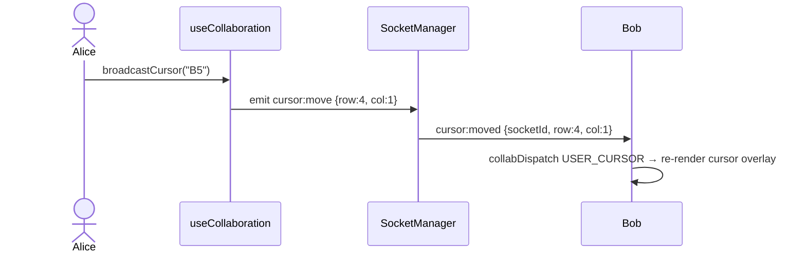
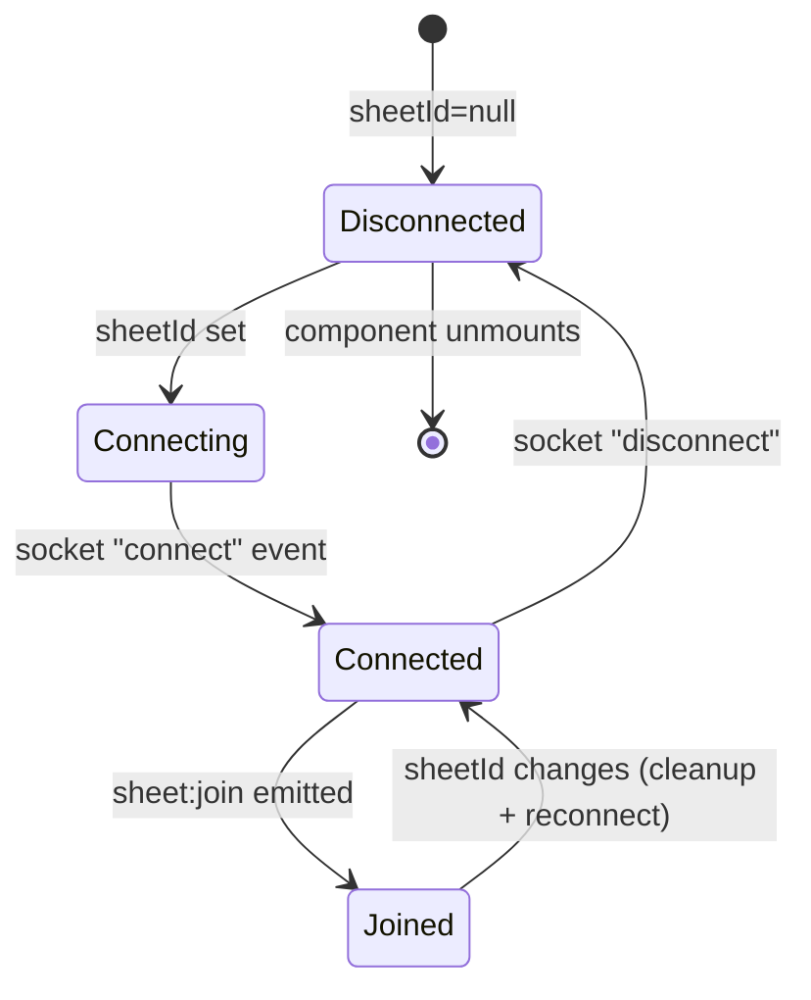

# Collaboration

## What We Actually Use: LWW-Register CRDT

The term "CRDT" in the codebase refers specifically to a **Last-Writer-Wins (LWW) Element Register** — one register per cell. This is the same approach Google Sheets uses for concurrent cell editing.

> **Not a full CRDT document** (no Yjs / Automerge / vector clocks for rich-text). Cells are atomic values — the last writer wins. Merging concurrent writes to the *same cell* uses Lamport timestamps with `peerId` as a deterministic tiebreaker.

---

## The Two-Layer Conflict Model

OnSheet has two separate conflict-handling layers that work independently:



- **Frontend layer (CRDT):** Handles concurrent local edits / rapid typing — converges in memory without server involvement. The last `apply()` call wins.
- **Backend layer (OCC):** Detects two *different* clients writing different values to the same DB row at the same time. The frontend does **not** send `baseVersion` via WebSocket, so OCC is bypassed for collaborative edits (LWW on the client is the reconciliation mechanism). OCC is only exercised via the HTTP `PUT /cells` REST endpoint.

---

## CrdtDoc — Implementation

```
lib/collaboration/crdt.ts
```

Each cell in the doc is an `CrdtEntry`:

```ts
interface CrdtEntry {
  ref: string;        // A1 notation key, e.g. "B3"
  raw: string;        // cell value / formula
  style?: CellStyle;
  timestamp: number;  // Lamport clock — monotonically increasing per peer
  peerId: string;     // globally unique ID generated at session start
}
```

### Lamport Clock Rules

| Operation | Clock effect |
|---|---|
| `apply(ref, raw, style)` | `++this.clock` → assigns that timestamp to the new entry |
| `merge(entry)` | `this.clock = max(this.clock, entry.timestamp)` → then LWW compare |

### LWW Winner Selection

```ts
private wins(a: CrdtEntry, b: CrdtEntry): boolean {
  if (a.timestamp !== b.timestamp) return a.timestamp > b.timestamp;
  return a.peerId > b.peerId;  // deterministic tiebreaker on equal timestamps
}
```

Higher timestamp wins. On exact timestamp tie (clock skew), lexicographically higher `peerId` wins — both peers compute the same winner independently → **strong eventual consistency**.

### Remote Merge Strategy

When a `cell:updated` WS event arrives from the server, the frontend does NOT use the server's DB `version` number (different clock space). Instead it assigns `localClock + 1` as the remote entry's timestamp:

```ts
const serverTs = doc.currentClock + 1;
doc.merge({
  ref,
  raw,
  style: update.cell.style,
  timestamp: serverTs,
  peerId: update.userId ?? "__server__",
});
```

This guarantees that a server-confirmed write **always wins** over any speculative local edits still in-flight. After `mergeClocks()`, the local clock advances above this value so subsequent local edits can still beat later remote updates.

---

## Full Edit Flow — Single User Typing



---

## Full Edit Flow — Two Users, Same Cell



**Key insight:** No 409 conflict is raised for WS edits because `baseVersion` is never sent from the client over the WebSocket path. The 50ms batch's last-write-wins is the single source of truth — the CRDT on the client mirrors this by always making server confirmations win via `localClock + 1`.

---

## Undo / Redo

`HistoryManager` (`lib/history/history.ts`) is an operation-log undo stack:

- Each push stores `{ ref, oldRaw, oldStyle, newRaw, newStyle }` — delta, not snapshots
- Max **200 batches** (configurable)
- `undo()` replays the reversed delta through `setCellCrdt`, which applies it to the CRDT **and** broadcasts to peers
- New local edits clear the redo stack (standard undo semantics)

Undo is **local** — it undoes the current user's changes only. It does not affect collaborators.

---

## Presence — Cursors

```
lib/collaboration/presence.ts
```



- `PresenceTracker` is a simple `Map<userId, CollabUser>` with subscriber pattern
- Cursor state is **ephemeral on the client** — not stored in the browser. On the server, the latest cursor position is persisted in the Redis presence hash (`presence:room:{sheetId}`) and is included in `sheet:users` when a new user joins, so late-joiners see current cursor positions.

---

## Connection Lifecycle



On every `connect` / reconnect, `sheet:join` is re-emitted automatically (the `onConnect` handler):

```ts
const unsubConnect = socket.onConnect(() => {
  socket.send("sheet:join", { sheetId, workbookId });
  collabDispatch({ type: "SET_CONNECTED", connected: true });
});
```

This makes reconnects transparent — the gateway re-adds the socket to its room and the client receives an updated `sheet:users` list.

---

## What Is and Is Not CRDT Here

| Property | Status |
|---|---|
| Strong eventual consistency | ✓ — same inputs → same cell map on every peer |
| Commutativity (edits to different cells) | ✓ — every cell is independent |
| Idempotency (replaying same op) | ✓ — `merge()` is idempotent by LWW comparison |
| Intent preservation for same-cell concurrent edits | ✗ — only the last writer survives; the other edit is silently dropped |
| Structure/text-level merging (e.g. appending to a string) | ✗ — cells are atomic strings; no character-level CRDT |
| Offline-first / full causal history | ✗ — no vector clock, no causal ordering across sessions |

For a spreadsheet, this is the right tradeoff — same cell concurrent edits are rare, and users expect deterministic (not merged) results.
