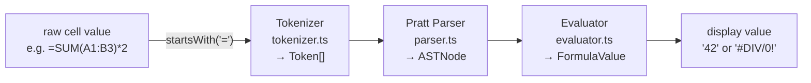

# Formula Engine

OnSheet includes a **fully client-side formula engine** — no server round-trip for live evaluation during editing. The pipeline is:

```
raw string  →  Tokenizer  →  Token[]  →  Pratt Parser  →  AST  →  Evaluator  →  FormulaValue
```

Files: `lib/formula/tokenizer.ts` · `lib/formula/parser.ts` · `lib/formula/evaluator.ts` · `lib/formula/types.ts` · `lib/formula/functions/`

---

## Pipeline



Non-formula cells (`!startsWith('=')`) skip the pipeline entirely — `raw` is the display value.

---

## AST Node Types

| Node type | Example |
|---|---|
| `number` | `3.14` |
| `string` | `"hello"` |
| `boolean` | `TRUE` |
| `error` | `#REF!` |
| `cell_ref` | `A1`, `$B$3` |
| `range_ref` | `A1:C10` |
| `unary_op` | `-A1`, `+5` |
| `binary_op` | `A1+B2`, `C3*D4` |
| `function_call` | `SUM(A1:A10, 5)` |

---

## Evaluation

**Entry point:** `evaluate(formula: string, cells: CellMap): FormulaValue`

- `formula` — raw string **without** the leading `=`
- `cells` — `Record<string, CellData>` (the current `spreadsheetState.cells` snapshot)
- Returns `string | number | boolean`

### Circular Reference Guard

A `Set<string> visiting` guards circular refs. If cell A1 contains `=A1`, the evaluator detects the cycle and returns `"#REF!"`.

### Lazy Formula Cells

When a referenced cell is itself a formula, the evaluator recurses:

```ts
if (isFormula(cell.raw)) {
  visiting.add(ref);
  const result = evaluate(cell.raw.slice(1), cells);
  visiting.delete(ref);
  return result;
}
```

---

## Supported Functions

### Math (17)

| Function | Description |
|---|---|
| `SUM` | Sum of all arguments / range |
| `AVERAGE` | Arithmetic mean |
| `MIN` / `MAX` | Minimum / maximum |
| `COUNT` | Count numeric values |
| `COUNTA` | Count non-empty values |
| `ABS` | Absolute value |
| `ROUND` / `FLOOR` / `CEILING` | Rounding |
| `SQRT` | Square root |
| `POWER` | `base ^ exponent` |
| `MOD` | Modulo |
| `INT` | Floor to integer |
| `PI` | π constant |
| `RAND` | Random 0–1 |
| `SUMPRODUCT` | Sum of products of corresponding ranges |

### Text (14)

| Function | Description |
|---|---|
| `CONCATENATE` / `CONCAT` | Join strings |
| `LEFT` / `RIGHT` / `MID` | Substring extraction |
| `LEN` | String length |
| `TRIM` | Remove extra whitespace |
| `UPPER` / `LOWER` / `PROPER` | Case conversion |
| `SUBSTITUTE` | Find-and-replace within string |
| `REPT` | Repeat string N times |
| `FIND` | Case-sensitive character position |
| `TEXT` | Format number as string |

### Logical (10)

| Function | Description |
|---|---|
| `IF` | Conditional: `IF(test, true, false)` |
| `AND` / `OR` / `NOT` / `XOR` | Boolean operators |
| `IFERROR` | Return alt value on error |
| `IFNA` | Return alt value on `#N/A` |
| `TRUE` / `FALSE` | Boolean constants |
| `SWITCH` | Multi-case conditional |

### Date (12)

| Function | Description |
|---|---|
| `TODAY` / `NOW` | Current date / datetime |
| `DATE` | Construct date from year/month/day |
| `YEAR` / `MONTH` / `DAY` | Extract date components |
| `HOUR` / `MINUTE` / `SECOND` | Extract time components |
| `DATEDIF` | Difference between dates in units |
| `WEEKDAY` | Day of week (1–7) |
| `EDATE` | Date N months from start date |

### Lookup (7)

| Function | Description |
|---|---|
| `INDEX` | Value at position in range |
| `MATCH` | Position of value in range |
| `VLOOKUP` | Vertical lookup |
| `HLOOKUP` | Horizontal lookup |
| `CHOOSE` | Select value by index |
| `ROW` / `COLUMN` | Row or column number of a cell ref |

**Total: 60 functions**

---

## Error Values

| Error | Cause |
|---|---|
| `#NAME?` | Unknown function name |
| `#REF!` | Circular reference or invalid cell ref |
| `#DIV/0!` | Division by zero |
| `#VALUE!` | Wrong argument type |
| `#ERROR!` | Unhandled evaluation exception |
| `#N/A` | `MATCH` / `VLOOKUP` — value not found |

---

## Client vs Server Evaluation

| Trigger | Who evaluates |
|---|---|
| Live typing (formula bar) | Client — `evaluate()` runs on every keystroke for preview |
| Cell committed (Enter/blur) | Client computes `computed` → sends `{ rawValue, computed }` to backend via WS |
| `cell:updated` received from WS | Server's `computed` field used — overrides client eval for formula result |
| AI `set_cells` write tool | Server sets `rawValue = computed = value` (no formula eval on server) |

The server stores `computed` exactly as sent by the client. There is no server-side formula evaluator — the client is the canonical formula engine.

---

## Number Formatting (`lib/cell/formatter.ts`)

Cell display values can be further formatted without changing `rawValue`:

| Format ID | Example output |
|---|---|
| `auto` / `plain` | `42.5` |
| `number` | `42.50` |
| `percent` | `42.50%` |
| `currency_usd` | `$42.50` |
| `currency_eur` | `€42.50` |
| `currency_gbp` | `£42.50` |
| `currency_inr` | `₹42.50` |
| `scientific` | `4.25E+1` |
| `accounting` | `(42.50)` for negatives |
| `date_short` / `date_long` / `date_iso` | Locale-aware date strings |
| `time` / `datetime` | Locale-aware time strings |
