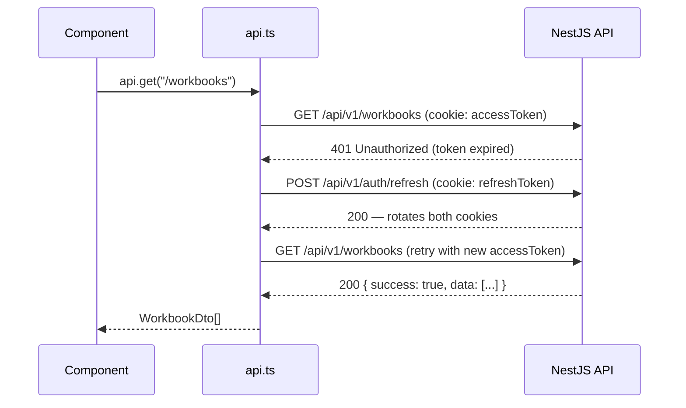

# Services & API Layer

The frontend communicates with the NestJS backend through a thin typed HTTP client (`services/api.ts`) and per-resource service modules.

---

## HTTP Client (`services/api.ts`)

### Auto-Refresh Flow



**Deduplication:** Multiple concurrent 401s only trigger a single refresh request — `refreshPromise` is a shared singleton. Subsequent callers await the same promise and then replay their original requests.

**Session expiry (refresh also fails):**
- Sets `session=; max-age=0` to clear the marker cookie
- Redirects to `/login?next=<current path>`
- Skips redirect on `/share/*` — public pages don't need auth

**Response unwrapping:** The backend wraps all responses as `{ success, data }`. The client automatically returns `body.data ?? body` so service callers receive the plain DTO.

**204 handling:** `res.status === 204` returns `undefined as T` without parsing JSON.

---

## Service Modules

### `workbookService` (`services/workbookService.ts`)

Workbook and sheet CRUD only. Permissions and sharing live in `spreadsheetService`.

| Method | HTTP | Endpoint | Returns |
|---|---|---|---|
| `list()` | GET | `/workbooks` | `Workbook[]` |
| `sharedWithMe()` | GET | `/workbooks/shared-with-me` | `SharedWorkbook[]` (includes `owner` + lowercase `myRole`) |
| `get(id)` | GET | `/workbooks/:id` | `Workbook` (with `sheets[]`, `myRole`) |
| `create(body)` | POST | `/workbooks` | `Workbook` |
| `update(id, body)` | PATCH | `/workbooks/:id` | `Workbook` |
| `delete(id)` | DELETE | `/workbooks/:id` | `void` |
| `listSheets(workbookId)` | GET | `/workbooks/:id/sheets` | `Sheet[]` |
| `createSheet(workbookId, body)` | POST | `/workbooks/:id/sheets` | `Sheet` |
| `deleteSheet(workbookId, sheetId)` | DELETE | `/workbooks/:id/sheets/:sid` | `void` |

---

### `cellService` (`services/cellService.ts`)

| Method | HTTP | Endpoint | Returns |
|---|---|---|---|
| `list(sheetId)` | GET | `/sheets/:sheetId/cells` | `ApiCell[]` |
| `upsert(sheetId, dto)` | PUT | `/sheets/:sheetId/cells` | `ApiCell` |
| `bulkUpsert(sheetId, cells)` | PUT | `/sheets/:sheetId/cells/bulk` | `{ count: number }` |
| `bulkImport(sheetId, cells, onProgress?)` | PUT (chunked) | `/sheets/:sheetId/cells/bulk` | `{ count: number }` |

**`bulkImport` chunking:** Splits cells into **5 000-cell chunks** and calls `bulkUpsert` sequentially. Calls `onProgress(pct)` after each chunk for progress bar updates.

---

### `spreadsheetService` (`services/spreadsheetService.ts`)

Handles **permissions and public sharing** for a workbook. Sheet CRUD lives in `workbookService`; snapshots live in `snapshotService`.

| Method | HTTP | Endpoint | Returns |
|---|---|---|---|
| `listPermissions(workbookId)` | GET | `/workbooks/:id/permissions` | `Permission[]` |
| `share(workbookId, dto)` | POST | `/workbooks/:id/permissions` | `Permission` |
| `revokeAccess(workbookId, targetUserId)` | DELETE | `/workbooks/:id/permissions/:targetUserId` | `void` |
| `getShareInfo(workbookId)` | GET | `/workbooks/:id/share-info` | `ShareInfo` |
| `setPublicAccess(workbookId, publicAccess)` | PATCH | `/workbooks/:id/public-access` | `ShareInfo` |

```ts
interface ShareInfo { shareToken: string | null; publicAccess: boolean; }
interface Permission { userId: string; email: string; name: string; role: "viewer" | "commenter" | "editor"; }
```

---

### `commentService` (`services/commentService.ts`)

| Method | HTTP | Returns |
|---|---|---|
| `list(sheetId)` | GET `/sheets/:sheetId/cells/comments` | `CommentDto[]` |
| `create(sheetId, dto)` | POST `.../comments` | `CommentDto` |
| `delete(sheetId, commentId)` | DELETE `.../comments/:id` | `void` |

---

### `snapshotService` (`services/snapshotService.ts`)

Standalone service for sheet snapshots (not a wrapper over `spreadsheetService`).

| Method | HTTP | Endpoint | Returns |
|---|---|---|---|
| `list(workbookId, sheetId)` | GET | `/workbooks/:id/sheets/:sid/snapshots` | `Snapshot[]` |
| `create(workbookId, sheetId, name?)` | POST | `.../snapshots` | `Snapshot` |
| `restore(workbookId, sheetId, snapshotId)` | POST | `.../snapshots/:snapId/restore` | `{ restored: boolean; snapshotId: string }` |

```ts
interface Snapshot {
  id: string; name: string; createdAt: string;
  user: { id: string; displayName: string; avatarUrl: string | null };
}
```

---

### `userService` (`services/userService.ts`)

| Method | HTTP | Returns |
|---|---|---|
| `me()` | GET `/users/me` | `UserDto` |
| `update(dto)` | PATCH `/users/me` | `UserDto` |
| `changePassword(dto)` | PATCH `/users/me/password` | `void` (204) |
| `delete()` | DELETE `/users/me` | `void` (204) |

---

### `aiService` (`services/aiService.ts`)

Single method — only the agent endpoint is exposed from the frontend service.

| Method | HTTP | Endpoint | Returns |
|---|---|---|---|
| `ask(sheetId, query)` | POST | `/ai/agent` | `AgentResult` |

```ts
interface AgentResult {
  answer: string;
  toolsUsed: string[];
  actions: AgentAction[];  // applied as optimistic updates to spreadsheetStore
}
```

---

## `ApiCell` → `CellData` Transformation

`spreadsheetReducer` handles `LOAD_CELLS` by transforming the raw `ApiCell[]` from the API into the `Record<string, CellData>` map:

```ts
// ApiCell (from API)
interface ApiCell {
  id: string;
  sheetId: string;
  row: number; col: number;
  rawValue?: string | null;
  computed?: string | null;
  style?: CellStyle;
  version?: number;
}

// CellData (in-memory render key)
interface CellData {
  raw: string;
  computed: string;
  style?: CellStyle;
}
// Key: A1 notation, e.g. cellRef(row, col) = "A1"
```

---

## Auth Endpoints (no service module — used inline)

Auth routes are called directly inside components/context rather than via a service module:

| Operation | Call site |
|---|---|
| `POST /auth/login` | `(auth)/login/page.tsx` |
| `POST /auth/register` | `(auth)/signup/page.tsx` |
| `POST /auth/refresh` | `services/api.ts` (auto-refresh interceptor) |
| `POST /auth/logout` | User menu component |
| `GET /auth/me` | `lib/auth/AuthContext.tsx` |
