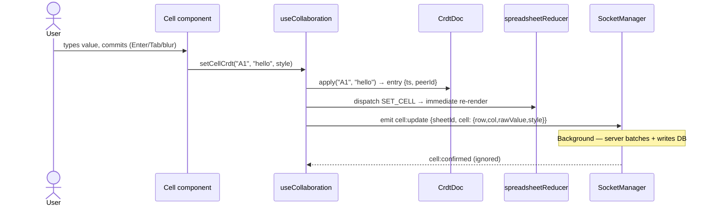

# State Management

OnSheet uses `useReducer` + custom hooks — no global state library. State is co-located with the component that owns it, and passed down or shared via React context only where necessary.

---

## State Map

```mermaid
graph TD
    Page["sheet/[id]/page.tsx"]

    Page --> SS["useSpreadsheet\n→ spreadsheetReducer\n(cells, sheets, workbook, loading/error)"]
    Page --> UC["useCollaboration\n→ collabReducer\n(users, cursors, connected)\n→ historyReducer\n(canUndo, canRedo)"]

    Page --> Sel["useSelection\n→ selectionReducer\n(active, range, isDragging)"]
    Page --> UI["uiReducer\n(formulaBarValue, isEditingCell,\nshowContextMenu, contextMenuPos)"]
    Page --> Resize["useResize\n(local)\n(column widths, row heights)"]
    Page --> VO["useViewOptions\n(local)\n(showGridlines, showFormulaBar,\nshowHeaders, zoom, frozenRows)"]
    Page --> KB["useKeyboard\n(consumes selection + collab dispatch)"]
    Page --> Clip["useClipboard\n(consumes selection + spreadsheetDispatch)"]
    Page --> DA["useDataActions\n(insert/delete row/col, sort, dedup)"]
    Page --> FA["useFileActions\n(import xlsx/csv, export)"]
    Page --> Tools["useToolsActions\n(toolbar formatting shortcuts)"]
    Page --> FormatA["useFormatActions\n(cell style application)"]
    Page --> AI["services/aiService.ts\n(direct — no hook)"]
```



---

## `spreadsheetStore` — Core Data

**File:** `store/spreadsheetStore.ts`

```ts
interface SpreadsheetState {
  workbookId: string | null;
  workbookTitle: string;
  myRole: "OWNER" | "EDITOR" | "VIEWER" | "COMMENTER" | null;
  activeSheetId: string | null;
  sheets: SheetMeta[];
  cells: Record<string, CellData>;   // keyed by A1 ref ("A1", "B3", ...)
  columnWidths: Record<number, number>;
  rowHeights: Record<number, number>;
  loading: boolean;
  error: string | null;
}
```

**Cell map key:** A1 notation string (`"A1"`, `"B3"`, `"AA100"`) — produced by `lib/utils/coordinates.ts`.

### Actions

| Action | Effect |
|---|---|
| `INIT_SHEET` | Set workbook meta + sheet list + active sheet ID |
| `SET_ACTIVE_SHEET` | Switch active sheet tab (triggers `loadSheet`) |
| `LOAD_CELLS` | Replace `cells` map with fresh DB load (transforms `ApiCell[]` → `Record<string, CellData>`) |
| `SET_CELL` | Upsert a single cell by ref |
| `SET_WORKBOOK_NAME` | Rename workbook locally |
| `SET_COLUMN_WIDTH` / `SET_ROW_HEIGHT` | Resize a column or row |
| `ADD_SHEET` / `REMOVE_SHEET` / `RENAME_SHEET` | Sheet CRUD from WS events or user action |
| `INSERT_ROW` | Shift all rows at or below the target down by 1 |
| `INSERT_COL` | Shift all columns at or to the right of the target right by 1 |
| `DELETE_ROW` | Shift rows below the target up by 1 |
| `DELETE_COL` | Shift columns right of the target left by 1 |
| `SORT_COLUMN` | Sort all rows by the value in a given column |
| `REMOVE_DUPLICATES` | Remove rows with duplicate values in a given column |
| `IMPORT_CELLS` | Bulk-replace entire cell map (used after xlsx/csv import) |

---

## `collaborationStore`

**File:** `store/collaborationStore.ts`

```ts
interface CollaborationState {
  connected: boolean;
  users: CollabUser[];    // other people in the same sheet room
  localPeerId: string;   // stable ID for this browser session
}

interface CollabUser {
  id: string;           // userId (or socketId for guests)
  name: string;
  color: string;        // one of 8 assigned colors, deterministic by userId hash
  activeCellRef?: string; // cursor position in A1 notation
}
```

### Actions

| Action | Effect |
|---|---|
| `SET_CONNECTED` | Toggle connected flag |
| `SET_USERS` | Replace entire user list (from `sheet:users` / `user:joined`) |
| `USER_JOIN` | Append one user (guards against duplicates) |
| `USER_LEAVE` | Remove user by ID |
| `USER_CURSOR` | Update `activeCellRef` for a user |

---

## `historyStore`

**File:** `store/historyStore.ts`

Thin UI-state mirror of `HistoryManager`:

```ts
interface HistoryState {
  canUndo: boolean;
  canRedo: boolean;
}
```

The actual undo/redo stacks live inside the `HistoryManager` class instance (in `useCollaboration`). After each `undo()` / `redo()` / `push()`, the hook dispatches `SET_CAN_UNDO` / `SET_CAN_REDO` to keep UI controls in sync.

---

## `uiStore`

**File:** `store/uiStore.ts`

Thin reducer for formula-bar and context-menu UI state. Consumed directly in the sheet page component (not via a named hook).

```ts
interface UIState {
  formulaBarValue: string;                            // current text in the formula bar
  isEditingCell: boolean;                             // whether a cell editor is active
  showContextMenu: boolean;
  contextMenuPos: { x: number; y: number } | null;
}
```

### Actions

| Action | Effect |
|---|---|
| `SET_FORMULA_BAR` | Update formula bar text (bails early if value unchanged) |
| `SET_EDITING` | Toggle cell editor mode (bails early if unchanged) |
| `SHOW_CONTEXT_MENU` | Set position and show context menu |
| `HIDE_CONTEXT_MENU` | Hide context menu, clear position |

---

## `useSpreadsheet` Hook

**File:** `hooks/useSpreadsheet.ts`

Owns the spreadsheet `useReducer` and exposes:

| Export | Purpose |
|---|---|
| `state` | Full `SpreadsheetState` |
| `dispatch` | `React.Dispatch<SpreadsheetAction>` |
| `loadWorkbook(workbookId, tabSheetId?)` | Fetch workbook metadata → initial sheet → cells |
| `loadSheet(sheetId)` | Switch tab — re-uses cached workbook if already loaded |

**Tab switch optimization:** If the workbook is already loaded (`stateRef.current.workbookId !== null`), `loadSheet` only fetches cells — skips the workbook re-fetch. Cells load is still awaited per-tab (not cached) to always show fresh DB data.

---

## `useCollaboration` Hook

**File:** `hooks/useCollaboration.ts`

Owns `CrdtDoc`, `SocketManager`, `HistoryManager`, `PresenceTracker` as stable refs/memos. Manages two reducers (`collab` + `histState`).

| Export | Purpose |
|---|---|
| `collab` | `CollaborationState` (users, connected, peerId) |
| `histState` | `{ canUndo, canRedo }` |
| `setCellCrdt(ref, raw, style?, computed?)` | Apply + broadcast a local edit |
| `undo()` | Reverse last local op + broadcast |
| `redo()` | Re-apply last undone op + broadcast |
| `broadcastCursor(cellRef)` | Emit `cursor:move` to peers |
| `loadIntoCrdt(entries)` | Bulk-load cells into the CRDT doc on initial page load |
| `peerId` | Stable peer ID for this session |
| `pickColor(id)` | Deterministic color hash by user/peer ID |

---

## Selection State (`useSelection`)

**Files:** `hooks/useSelection.ts` + `store/selectionStore.ts`

Uses `useReducer` backed by `selectionReducer` from `store/selectionStore.ts` (not plain React state):

```ts
interface SelectionState {
  active: CellCoord | null;        // currently focused cell {row, col}
  range: SelectionRange | null;    // { start: CellCoord, end: CellCoord }
  isDragging: boolean;             // true while mouse is held for range-select
}
```

`SET_ACTIVE` automatically sets `range` to a single-cell range at `active`. Never needs to survive navigation — selection resets on tab switch.

---

## Data Flow — Cell Edit



**The rule:** `spreadsheetReducer.cells` is the single source of truth for rendering. The CRDT doc is the merge layer for concurrent write resolution. They are kept in sync by every `setCellCrdt` and every `cell:updated` handler.
